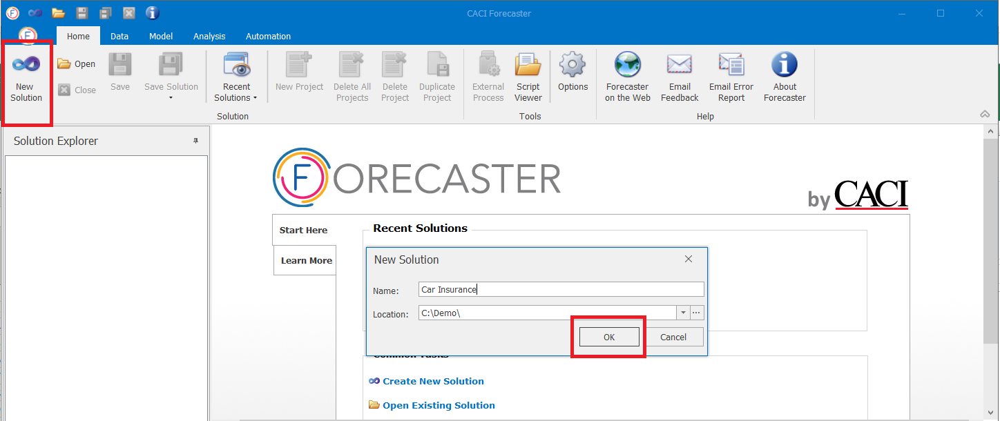
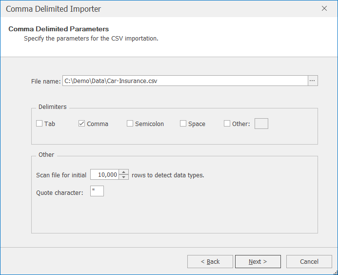
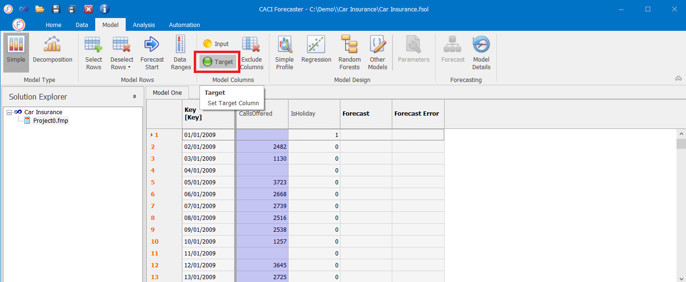
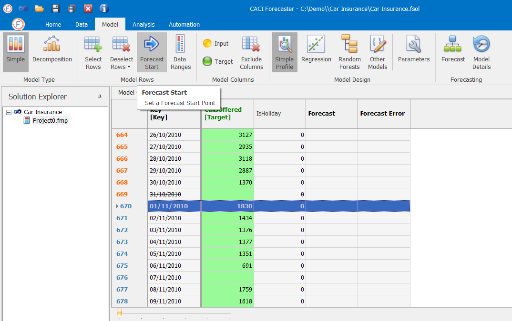
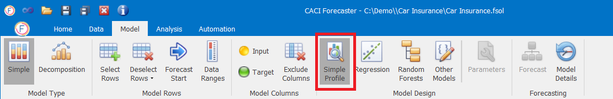
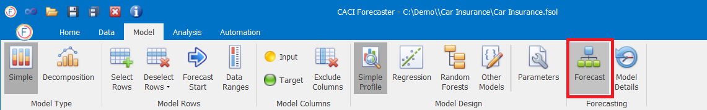
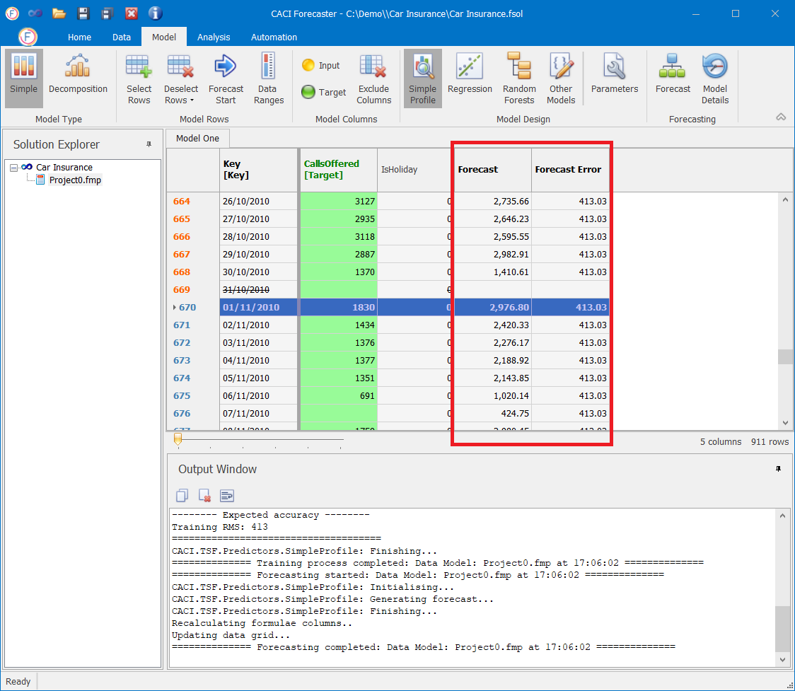
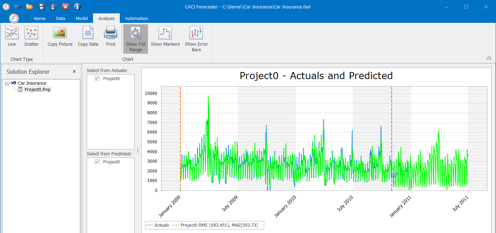

# Quick Start

The CACI Forecaster provides planners with the best forecasting models available. These models provide superior forecasting accuracy when compared with existing ~~workforce management products~~. CACI Forecaster is quick and easy to use and provides a controlled and straightforward forecast generation process.

### Before you start

Make sure that you have the following:

1. CACI Forecaster installed,
2. the "Car Insurance" dataset - can be downloaded from the link below.



### Create a new Solution
- **Open** CACI Forecaster.

- In CACI Forecaster **click** “New” to create a new solution.

- **Type** in a solution name i.e. "Car Insurance" in the pop-up window.

- **Click** “OK” to continue.

### Import the Data
- In the “Data Importer” part of the ribbon, **select** the "Text" icon then the "Import" icon – this tells the forecaster that you are going to import a text file.


Forecaster can also import from Excel files or run any custom process using the script ~~import to import~~ (??) data i.e. database extraction, data pre-processing, etc.


- In the pop-up window start a new importation by clicking "Next" and browse for the data file “Car Insurance”.

- After checking that the comma delimiters option is ticked, continue to **click** “Next” until you see the following window, below:

### Prepare Data

- **Select** the "CallsOffered" column header and **click** on "Target".

- Now you need to select a “Start point”. **Scroll down** to row with date "01/11/2010" and **select** the row by clicking on the row header. Then **click** on the the Forecast Start button - the row will turn light blue.


The data above the “Forecast Start” is historic data that CACI Forecaster will use to train the model. ~~The data below the “Forecast Start” will be used to validate the model - CACI Forecaster will only use the key driver data below the “start point” to determine the target~~


### Forecasting

- **Select** the "Simple Profile" model.

- and then **click** on the "Forecast" button!

- The forecast and predicted error will appear in the data table. Details of the model are also displayed in the output window.

### Analyze results
- **Click** on the "Analysis" tab - a graph of the actual target value and forecast target is displayed with a range of performance metrics.

