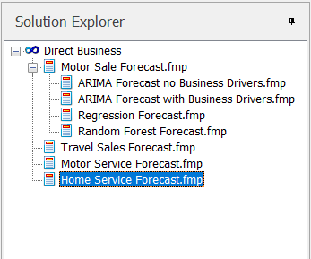
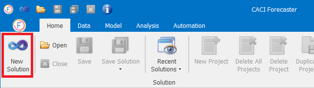
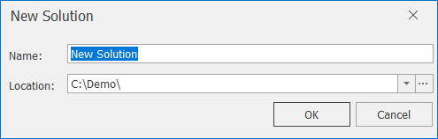
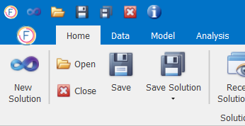

## Solution

### Solution Hierarchy

At this point it is sensible to talk about the hierarchy of a solution.  Once a new solution has been defined or loaded, its structure can be seen in the Solution Explorer window.  A solution may contain one or more projects.  The projects can be related to one another, such as projects with the same dataset but with differing forecasting models, or they can be completely unrelated but grouped in the solution for convenience. For example, all call volume forecasts in a contact centre could be grouped into one solution.  The image below demonstrates that forecast projects for Motor, Home and Travel can be grouped in the same solution.

Each of these projects contains different sources of data, however, for the sake of simplicity it makes sense to group all of these forecasts in the same place.  For example, if other planners need to build forecasts in someone’s absence, all active forecast models will be in the same collection.

Notice in the example that within the Motor Sales forecast there are a number of sub-forecasts or project snapshots.  These snapshots represent a collection of Motor Sales forecasts that share common data with the project one level up.  The purpose of this hierarchy is to allow the user to keep a copy of all experiments considered valuable, for example a collection of forecast models that yield good predictions.

### Solution Management

There is a number of management activities which can be carried out on Forecaster Solutions. More details follow in this section.

#### New Solution

The New Solution icon (or quick keys `Ctrl+N`) allows the user to create a new forecast solution. 

When users select to create a new solution, they are required to enter a solution name and, if necessary, change the location of the solution directory.  Once these parameters have been specified and the user presses the OK button, the new solution will be created.  

Users can now create Projects and import their own data. For Creating a Project go to the link below:



#### Open, Close and Save a Solution

A Solution in Forecaster can be managed through the options available in the Home Tab.

*	To **open** a solution, click on the Open icon, select the file of interest and select OK.  Alternatively press the `Ctrl+O` keys to access the same open solution dialog
*	To **close** a solution, click on the Close icon.  If the solution has had some changes before the last save, then the application will ask you if you wish to save the changes
*	To **save** a solution, select the Save icon.  This will then display two save options:
    -	Save:  Saves the solution under the current name.  Files can be saved directly by pressing the `Ctrl+S` keys
    -	Save As: This enables you to save the solution under a new name or in a different location

Additionally all of the above functionality can be executed from any point in the application using the quick access toolbar, displayed in the top left of the CACI Forecaster. 
 


When a solution is saved, a solution directory is created and a number of files are placed in this directory.  If you wish to move a forecast solution without using Save As, for example if you have multiple solutions to move, you need to copy all elements in the solution directory to the new location, otherwise the hierarchy defined in the solution view will be broken.


#### Deleting a Solution
To delete a solution, delete the solution directory through the usual Windows Explorer or equivalent.

#### Recent Solutions
Links to recent solutions are available via the Home – Solution ribbon or in the main window in Home.  As checks are made prior to a solution appearing in the list, all recent solutions listed will be valid and accessible.  If files are subsequently deleted, they will not be displayed in the options list.
Selecting from this list will save you time and effort trying to find the location of previous solutions you may have been working on.

