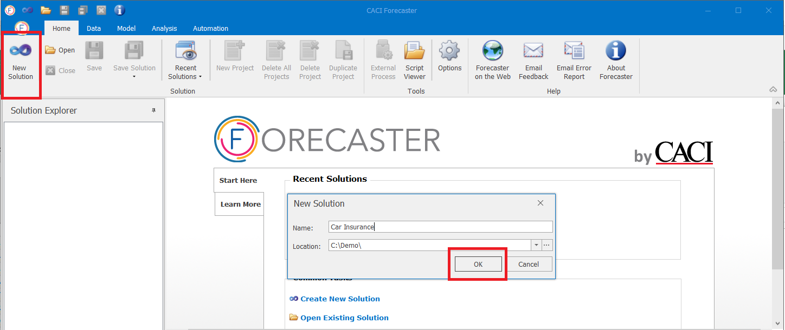
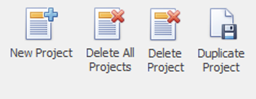

# Home Tab - Solution Section
The *Solution* section of the main Home tab lets you create and manage solutions and projects.  A solution is a workspace that can hold any number of forecast projects. On the other hand, a project holds data, a forecasting model, as well as the forecasts themselves.

The first part of the *Solution* section lets you create, save, open and close solutions. These buttons cover all the standard operations that you'd expect when creating, for example, a Word or Excel document.  The second part of the *Solution* group focusses on managing projects within the solution.

## Managing Solutions

The **New Solution** button (or quick keys `Ctrl+N`) is used to create a new forecast solution. This is a workspace that can hold any number of forecast projects. When a new solution is created, it is given a name, and saved into a specific folder.  

Once these parameters have been specified and the **OK** button is clicked, the new solution is created.  This solution is a folder with a number of files (*.fsol for the solution itself, and *.fmp for individual projects within the solution).
 
The solution **Open**, **Close** and **Save** buttons are pretty standard, and work as you'd expect to open, close, and save the solution.

* To open a solution, click on the **Open** button (or quick keys `Ctrl+O`), select a Forecaster solution file (named *.fsol) and select OK.  
* To close a solution, click on the **Close** button.  If the solution has been changed since the last save, you'll be asked if you'd like to save those changes
* To save a *project*, click the **Save** button.  This will save only the current active project (the one selected in the Solution Explorer to the left of the screen). 
* To save the *solution*, click the **Save Solution** button.  This will then bring up two save options:
    * Save:  Saves the whole solution. Quick keys `Ctrl+Shift+S` do the same thing
    * Save As: To save the solution under a new name or in a different location
 

All these actions can also be found on the quick access toolbar, right at the top left of the Forecaster window.

## Recent solutions
Links to recent solutions can be found either using the **Recent Solutions** button, or in the main window when you have the *Home* tab selected.  

## Moving solutions
When a solution is saved, a solution directory is created and a number of files are placed in this directory.  If you'd like to move a forecast solution without using Save As (for example if you have multiple solutions to move, or if you want to move rather than copy the solution), you can simply copy the whole solution folder to the new location.

## Deleting solutions
You can't delete a solution from within Forecaster, so the best way is to delete the solution folder using Windows Explorer (as you would for deleting a Word or Excel document - apart from the fact you're deleting a folder not a single file).

## Managing Projects

The right hand side of the Solution section of the Home tab ribbon holds basic project operations, such as creating, copying, or deleting.

* To create a new project, click on the **New Project** button. A new empty project will be created and added to the solution. (A project can also be created by right-clicking the Solution name at the top of the Solution Explorer window, then selecting *New Project*.) 
* To delete all projects within the solution, click on the **Delete All Projects** button.  (All projects can also be deleted by right-clicking the Solution name at the top of the Solution Explorer window, then selecting *Delete All Projects*.)  This operation cannot be undone, so a confirmation dialog will pop up to make sure that you definitely want to proceed.
* To delete only the currently selected project (the one currently highlighted in the Solution Explorer), click on the **Delete Project** button.  (A project can also be deleted by right-clicking its name in the Solution Explorer window, then selecting *Delete Project*.)   This operation cannot be undone, so a confirmation dialog will pop up to make sure that you definitely want to proceed.
* To create a copy of the currently selected project, click the **Duplicate Project** button.  This creates an identical copy of the project, including data, model and settings. To show the connection between the two projects, in the Solution Explorer the copy is placed below the original project. Focus moves to the new copy, and this new project is highlighted in the Solution Explorer.

