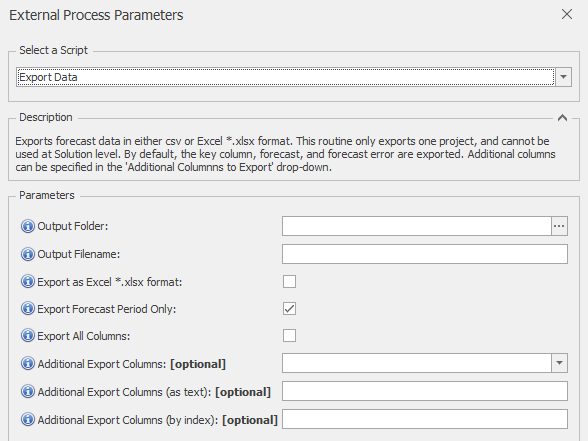
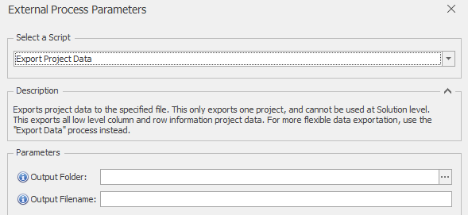
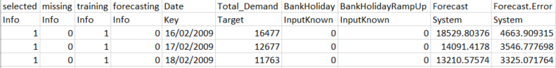
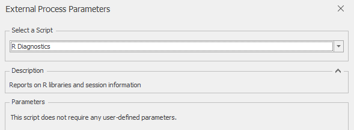
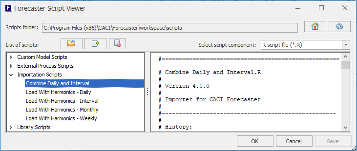

# Home Tab - Tools Section

The Tools section of the main ribbon's Home tab provides a range of tools for viewing scripts (Forecaster uses these typically for importing and exporting data, as well as providing all the forecasting models) and managing settings. It holds 3 buttons as shown here.

The following sections cover the operation of these 3 buttons

## External Process
External Processes are typically used for exporting data from Forecaster, or producing diagnostics or reports.  Forecaster ships with 3 standard script out of the box (as described below).  However, additional scripts can be created by CACI for customised operations such as exporting in specific formats, producing reports, or pushing data to databases.  Feel free to contact CACI if you're spending too much time manually exporting or combining data from Forecaster - a custom External Process may well be the best way of automating that process.  External Processes can also be created by any users familiar with the R environment.

Clicking the **External Process** button brings up a dialog box where you can chose the available external processes from a drop down box.  (External Processes can also be run by right-clicking on the project in the Solution Explorer, then selecting *External Process*.)  Forecaster ships with 3 custom scripts: *Export Data*, *Export Project Data*, and *R Diagnostics*. These are described below:

### *Export Data* External Process
This External Process provides a very flexible means of exporting data from Forecaster, and can save in both comma separated csv format and to Excel xlsx format.  It provides similar functionality to the inbuilt *Data Exporter* functionality (see TODO here), but has a little more flexibility in data formats and range filtering.

#### Parameters
 You can also get parameter information within Forecaster, by hovering over the blue **(i)** information icons
* **Output Folder**: The output folder to which the data should be exported
* **Output Filename**: The name of the file to which the data should be exported
* **Export as Excel .xlsx format**: If ticked, will export as Excel *.xlsx format, rather than the default csv format
* **Export Forecast Period Only**: If selected, only data from the forecast period will be exported.  If deselected, all rows are exported
* **Export All Columns**: If ticked, all columns will be exported
* **Additional Export Columns**: The columns selected from this drop-down will be exported, in addition to the key, forecast, and forecast error columns which are always exported
* **Additional Export Columns (as text)**: These columns will be exported, in addition to the key, forecast, and forecast error columns which are always exported.  Any number of columns can be specified here, separated by commas. This option can be useful in workflows where the drop-down column names above may not be available
* **Additional Export Columns (by index)**: The columns with indexes specified here will be exported, in addition to the key, forecast, and forecast error columns which are always exported. Any number of columns can be specified here, separated by commas. Index ranges (e.g. 4-8) can also be used. This option can be useful in workflows where the drop-down column names above may not be available

### *Export Project Data* External Process


This *Export Project Data* External Process exports all low level column and row information project data, and is really designed *only* for reading into other systems and diagnostic use.  For more flexible data exportation and a simpler output, it is usually preferable to use the standard "Export Data" process instead.


This process exports project data to the specified file.  This only exports one project, and cannot be used at Solution level.  

Data is saved in comma-separated csv format.  An example of output data is shown below.

#### Parameters
 You can also get parameter information within Forecaster, by hovering over the blue **(i)** information icons
* **Output Folder**: The output folder to which the data should be exported
* **Output Filename**: The name of the file to which the data should be exported

#### Output format

This process exports additional information columns:
* **selected**: This column holds 1 for all rows that are selected, and 0 for all deselected rows.  This flag is controlled by the user de-selecting and selecting rows in the Forecaster's main data grid
* **missing**: This column holds 1 for all missing rows (rows that are all blank), and 0 if any column (apart from the key column) in the row has a non-missing value.  This flag is set automatically by Forecaster based on the data in each row
* **training**: This column holds 1 for all rows in the training range, and 0 otherwise
* **forecasting**: This column holds 1 for all rows that are in the forecast range, and 0 otherwise

The first row in the output file holds the column headers, and the second row holds information on the usage of each column (for instance whether it is an input or target column).  Data is exported from row 3 onwards.
The possible values for the column information row are:
* **Info**: System information columns (not directly visible to the user in Forecaster).  The 4 columns just described are all *Info* type columns 
* **Key**: Identifies the key column.  This is the first column in the grid shown in Forecaster, and is usually the date or datetime column.
* **InputKnown**: This indicates that this column has been flagged up for use as a model input
* **Target**: This indicates that this column is flagged up for use as the model target
* **System**: Columns populated by Forecaster - typically just the *Forecast* and *Forecast Error* columns

### *R Diagnostics* External Process

The *R Diagnostics* external process provides detailed diagnostic information on the current R installation, including version information and packages loaded.  This process is usually only called on for debugging and system validation.

No parameters are required to run this process. Outputs include the library paths used (from .libPaths()), as well as session information returned by sessionInfo().

## Script Viewer

The Script Viewer allows direct viewing of the underlying R and xml files that provide importation, modelling, and external process functionality in Forecaster.  This process is usually only used for system validation and updating purposes.

The Script Viewer is brought up from the **Script Viewer** button in the *Tools* section of the *Home* tab.

THe low level detail on any of Forecaster's data importers, forecast models, and external processes can be viewed here.  A drop-down lets you select whether to view the R scripts or supporting xml files. Scripts can also be imported or removed from this tool.  (Adding or removing scripts can also be done by directly adding or removing script R and xml files to the scripts folder.)

## Options

3 tabs:

### General Parameters

### Script folders

### Proxy server settings

